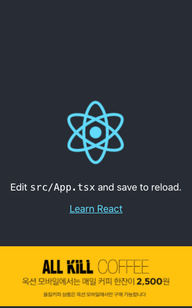

# danbi-exelbid-component


## Feature
`Exelbid` 의 배너 광고 기능을 React.js 컴포넌트로 제작

## Arguments
`adPosition` 을 제외한 데이터는 `ExelBID Admin` 에서 확인 할 수 있습니다. 

### Required
| property name | value type  | description               | sample |
| ------------- | ----------- | ------------------------- | ------ |
| `width`       | string      | 배너 광고의 width 값      | 320    |
| `height`      | string      | 배너 광고의 height 값     | 100    |
| `adUnitCode`  | string      | 배너 광고의 Unit Code 값  | -      |
| `adPosition`  | adDirection | 배너 광고를 배치시킬 위치 | bottom |


## Prototype

### Function Prototype

```typescript
Exelbid(props: exelbidType):JSX.Element
```
### Component Prototype

```jsx
<Exelbid
    width="danbi-test-width"
    height="danbi-test-height"
    adUnitCode="danbi-test-code"
    adPosition="danbi-test-position"
/>
```

## Usage


### Step 0. Install `danbi-exelbid-component` module

```cmd
`npm` 에서 `danbi-exelbid-component` 모듈을 다운로드 받습니다.
```

### Step 1. Import Module

`danbi-exelbid-component` 에서 `Exelbid` 컴포넌트를 import 시킵니다.

```tsx
import { Exelbid } from "danbi-exelbid-component"       // => Step 1.
```

### Step 2. Make Component Using `Danbi-Exelbid`

`Exelbid` 컴포넌트를 원하는 position 에 생성합니다.

```tsx
import { Exelbid } from "danbi-exelbid-component"       // => Step 2.

<Exelbid/>
```

### Step 3. Initialize Component Arguments
Exelbid 광고 배너 컴포넌트에 [args](#arguments)를 작성합니다.


```tsx {4,5,6,7}
import { Exelbid } from "danbi-exelbid-component"

<Exelbid
    width=""                                            // => Step 3.
    height=""                                           // => Step 3.
    adUnitCode=""                                       // => Step 3.
    adPosition=""                                       // => Step 3.
/>
```

### Step 4. Fin

광고 배너가 정상적으로 출력되는지 확인합니다.

