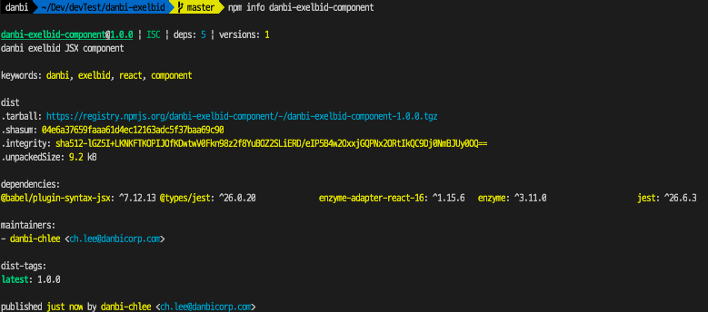

## Jest

### jest.config.ts

```bash
npm intall -D ts-node
```


## npm Error 402 Payment Required
> [Getting Error 402 while publishing package using npm](https://stackoverflow.com/questions/41981686/getting-error-402-while-publishing-package-using-npm/44862841)


### Error Code

```cmd
npm ERR! code E402
npm ERR! 402 Payment Required - PUT https://registry.npmjs.org/@danbi%2fexelbid - You must sign up for private packages
```


### Solution
1. set package.json `"private" : false`  
2. npm publish --access=public

#### Set package.json `"private" : false`  


```json title="package.json"
{
  "name": "danbi-exelbid-component",
  "version": "1.0.0",
  "description": "danbi exelbid JSX component",
  "main": "lib/index.js",
  "types": "lib/index.d.ts",
  "private": false,                                 // => Here
  "scripts": {
    "test": "jest",
    "build": "rm -rf ./lib && tsc"
  },
  "keywords": [
    "danbi",
    "exelbid",
    "react",
    "component"
  ],
  "author": "ChangHun Lee",
  "license": "ISC",
  "devDependencies": {
  },
  "dependencies": {
  }
}
```

#### npm publish --access=public


```bash
npm publish --access=public
```

## npm Error 403 Forbidden
> [NPM Publish Registry - 403 Forbidden - “You don't have permission to publish](https://stackoverflow.com/questions/54950544/npm-publish-registry-403-forbidden-you-dont-have-permission-to-publish)


### Error Code

```cmd
npm ERR! code E403
npm ERR! 403 403 Forbidden - PUT https://registry.npmjs.org/@danbi%2fexelbid - Forbidden
npm ERR! 403 In most cases, you or one of your dependencies are requesting
npm ERR! 403 a package version that is forbidden by your security policy.
```


### Solutions
1.  set package.json `"publishConfig": {"access": "public"}`
2. rename package.json module name

- ### Set package.json `"publishConfig": {"access": "public"}`

```json title="package.json"
{
  "name": "danbi-exelbid-component",
  "version": "1.0.0",
  "description": "danbi exelbid JSX component",
  "main": "lib/index.js",
  "types": "lib/index.d.ts",
  "private": false,
  "publishConfig": {
    "access": "public"                              // => Here
  },
  "scripts": {
    "test": "jest",
    "build": "rm -rf ./lib && tsc"
  },
  "keywords": [
    "danbi",
    "exelbid",
    "react",
    "component"
  ],
  "author": "ChangHun Lee",
  "license": "ISC",
  "devDependencies": {
  },
  "dependencies": {
  }
}
```

- ###  rename package.json module name

|      | Before        | After                   |
| ---- | ------------- | ----------------------- |
| Name | danbi-exelbid | danbi-exelbid-component |

- ### ! Alert
> 2021-02-18 일시에 `danbi-exelbid` 모듈이 unpublish 되어,  
24시간 동안 해당 이름의 모듈을 다시 publish 하는것이 불가능하여 모듈의 이름을 변경하였습니다.

```cmd
danbi-exelbid cannot be republished until 24 hours have passed.
```

### Fin.
> npm 을 통해서 `danbi-exelbid-component` 모듈의 완료하였습니다.



## Too Many Dependencies

typescript, jest 등을 사용해서 작업하였기 때문에 package.json 에는 다양한 모듈들이 설정되어있다.
이는 build 된후 npm publish 되는 상황에서는 필요하지 않다.

이렇게 작성되어진 package.json 은 추후에 우리 모듈을 다운로드 받을때 의존성에 의해서 같이 다운로드 되기 때문이다.


### Solutions
따라서 npm publish 용 package.json 을 새롭게 제작해야한다.