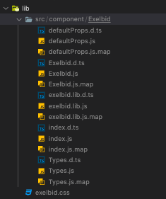
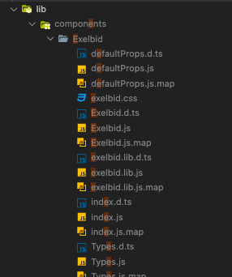

# TIP

## npm run prepare

### Summary
package.json 에서도 Option 키워드가 존재합니다. 
대표적인 예는 아래와 같습니다.

```json
"scripts" :{
    "start":"",
    "test":"",
    "build":"",
}
```

이외에도 다양한 Option 키워드가 존재하는데 이번에 말해볼것은 `prepare` 키워드 입니다.

### Description
`prepare` 키워드는 다른 script 명령어와 사용법이 동일합니다.
하지만, 한가지 특이한게 있다면 프로젝트나 모듈을 publish 하기전에 자동으로 실행된다는 점입니다.

예시로 NPM 에 모듈을 모듈을 배포하기 위해서는 아래와 같은 script 명령어를 작성해야합니다.

```cmd
// => build 된 프로젝트를 npm 에 배포하기 위해 사용되는 명령어 입니다.
npm publish
```

만약, `package.json` 에 `prepare` 명령어를 설정해 놓았다면 `publish` 전에 `prepare` 가 실행됩니다.

```cmd
// => script 명령어 입력
npm publish 

// => npm run prepare 명령어 실행
// => npm publish 명령어 실행
```

저 같은 경우 `danbi-exelbid-component`에서 npm 에 배포하는 모듈을 build 하고
자동으로 build 폴더에 포함되지 않는 정적 HTML, Css 를 옮기는데 사용하였습니다.

```cmd
"prepare": "yarn build && yarn copy-files",
```

### Usage Example
`danbi-exelbid-component` NPM 모듈을 만들떄 사용했던 package.json 파일 입니다.

```json
{
  "name": "danbi-exelbid-component",
  "version": "1.0.6",
  "description": "danbi exelbid JSX component",
  "main": "lib/index.js",
  "types": "lib/index.d.ts",
  "private": false,
  "publishConfig": {
    "access": "public"
  },
  "scripts": {
    "test": "jest",
    "build": "rm -rf ./lib && tsc",
    "copy-files": "copyfiles -f src/**/*.css lib/",
    "prepare": "yarn build && yarn copy-files",
    "release": "standard-version"
  },
  "keywords": [
    "danbi",
    "exelbid",
    "react",
    "component"
  ],
  "author": "ChangHun Lee",
  "license": "ISC",
  "devDependencies": {},
  "dependencies": {},
  "peerDependencies": {}
}
```

## copyfiles

### References 
-[npm copyfiles not correct target path](https://stackoverflow.com/questions/42572806/npm-copyfiles-not-correct-target-path)

### Description

빌드 과정에서 생성되지 않는 정적 파일인 .css , .html 파일등을 `copyfiles` 모듈을 이용하여 build 된 폴더로 옮기는 과정에서 문제가 발생하였습니다.

아래는 옮길려고 하는 파일이 존재하는 폴더 입니다.

```json
My base directory structure is:
src/component/**/*.css
```

아래는 옮기고자 하는 폴더 위치 입니다.

```json
What I want is:

lib/component/**/*.css
```


### 시도한 기존의 방법
기존에는 아래와 같은 방법을 사용하여 css 파일들을 build 된 폴더로 이동시켰다.
하지만, `lib/*.css` 와 같은 경로에 css 파일들이 옮겨진 것을 확인 할 수 있었습니다.

```json
"copy-css-files":"copyfiles -f src/**/*.css lib/"
```



### Solutions

`copyfile` 모듈의 옵션과 경로를 수정하여 build 된 폴더의 원하는 위치에 css 파일을 이동시켰다.

```json
"copy-css-files": "copyfiles -u 1 \"./src/**/*.css\" \"lib/src\"",
```

